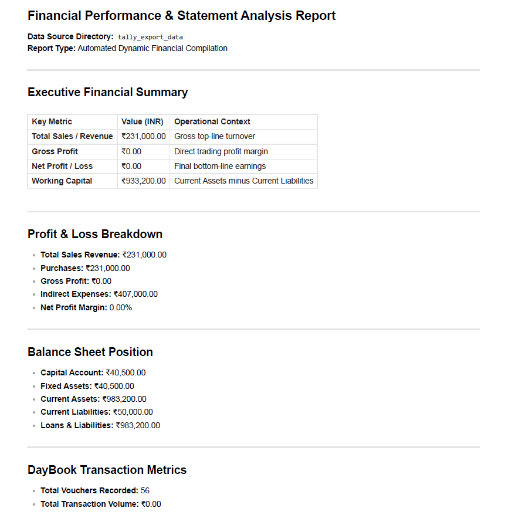

# Tally Automation & Financial Data Analytics

Tally Automation & Financial Data Analytics is a **Python-based GUI automation and financial reporting pipeline** that automates accounting data entry into Tally Prime and compiles automated executive financial reports from exported statement data.

The project uses PyAutoGUI to simulate keystrokes for importing ledgers, stock items, and daily vouchers into Tally Prime, alongside Pandas for parsing Tally Excel exports and generating dynamic financial summaries.



---

## Project Features

- Automated generation of Tally-compliant Excel datasets
- Robotic Process Automation (RPA) for Tally Prime ledger and voucher creation
- PyAutoGUI keyboard shortcut automation with fail-safe features
- Automated extraction and cleaning of Tally financial exports
- Trial Balance verification and double-entry balance check
- Profit & Loss (P&L) and Balance Sheet metric parsing
- Executive financial report generation in Markdown format
- DayBook transaction volume and voucher type distribution analysis

---

## Transaction & Master Types

The project handles the following accounting data elements:

1. **Master Ledgers:** Capital Accounts, Bank Accounts, Loans, Sundry Creditors, Sundry Debtors, Direct/Indirect Expenses, Fixed Assets, and Incomes
2. **Stock Items:** Primary inventory items with Units of Measurement (UOM)
3. **Voucher Types:** Receipt, Contra, Journal, Payment, Purchase, Sales, Debit Note, and Credit Note

---

## Technologies Used

- Python
- Pandas
- PyAutoGUI
- OpenPyXL
- Excel / CSV
- Markdown

---

## Project Structure

```text
tally-automation-analytics/
├── tally_export_data/
│   ├── BSheet.xlsx
│   ├── DayBook.xlsx
│   ├── PandL.xlsx
│   └── TrialBal.xlsx
├── Automate_tally_ledger_creation.py
├── analysis_for_me.py
├── generate_files.py
├── report_creation.py
├── Tally_Import_data.xlsx
├── report.md
├── requirements.txt
└── README.md
```

---

## File Information

| File / Folder | Purpose |
| --- | --- |
| `Automate_tally_ledger_creation.py` | Automates entry of ledgers, stock items, and vouchers into Tally Prime using PyAutoGUI |
| `generate_files.py` | Generates structured master accounts and double-entry transactions in `Tally_Import_data.xlsx` |
| `analysis_for_me.py` | Parses exported financial Excel files and verifies debit/credit totals |
| `report_creation.py` | Normalizes Tally export formats, calculates financial KPIs, and writes `report.md` |
| `Tally_Import_data.xlsx` | Multi-sheet Excel file containing Ledgers, Stock Items, and Voucher data |
| `tally_export_data/` | Directory holding raw Excel exports from Tally Prime (`DayBook`, `TrialBal`, `PandL`, `BSheet`) |
| `report.md` | Auto-generated Markdown report containing financial summaries and balance sheet breakdown |
| `requirements.txt` | Defines necessary Python library dependencies |

---

## Installation

### 1. Open the Project Folder

```text
cd tally-automation-analytics
```

### 2. Create a Virtual Environment

```text
python -m venv venv
```

### 3. Activate the Virtual Environment

For Command Prompt:

```text
venv\Scripts\activate
```

For PowerShell:

```text
venv\Scripts\Activate.ps1
```

### 4. Install the Required Libraries

```text
pip install -r requirements.txt
```

---

## How to Run

### 1. Generate the Import Dataset

Run the data creation script to generate the Excel file containing accounting masters and vouchers:

```text
python generate_files.py
```

This command creates:

```text
Tally_Import_data.xlsx
```

### 2. Execute Tally Prime Automation

Open Tally Prime, open your company file, navigate to the Gateway of Tally, and run:

```text
python Automate_tally_ledger_creation.py
```

*Note: A 5-second countdown gives you time to switch focus to the Tally Prime application window. Move the mouse cursor to any screen corner to trigger the PyAutoGUI fail-safe if needed.*

### 3. Generate Financial Performance Report

After exporting financial statements from Tally Prime into the `tally_export_data/` folder, run:

```text
python report_creation.py
```

This command creates:

```text
report.md
```

---

## System Workflow

```text
Generate Accounting Data (Excel)
           ↓
PyAutoGUI Tally Prime Automation
           ↓
Ledger & Voucher Entry in Tally Prime
           ↓
Export Financial Reports (Excel)
           ↓
Data Cleaning & Metric Parsing
           ↓
Trial Balance & Flow Verification
           ↓
Automated Markdown Report (.md)
```

---

## Financial Metrics Analyzed

The project extracts and verifies the following core metrics:

| Financial Metric | Analysis Scope |
| --- | --- |
| **Total Sales / Revenue** | Top-line turnover extracted from Profit & Loss statement |
| **Gross Profit** | Direct trading profit margin |
| **Net Profit / Loss** | Bottom-line earnings after operational expenses |
| **Working Capital** | Net liquid capital (Current Assets − Current Liabilities) |
| **Trial Balance Total** | Debit/Credit balance verification status |
| **DayBook Volume** | Total voucher count and transaction breakdown by type |

---

## Important Note

The GUI automation script depends on keyboard shortcut navigation and focused active windows in Tally Prime. Ensure Tally Prime is active on screen before the countdown ends.

This project is created for automation and educational purposes. Ensure test environments are used before executing bulk automation on production accounting data.

---

## Useful Links

- [Python](https://www.python.org/)
- [Pandas](https://pandas.pydata.org/)
- [PyAutoGUI](https://pyautogui.readthedocs.io/)
- [OpenPyXL](https://openpyxl.readthedocs.io/)
- [Tally Solutions](https://tallysolutions.com/)

---

## Created By

**Name:** Animesh Sanghi  
**Profession:** Google Certified Data Analyst  
[LinkedIn](https://www.linkedin.com/in/animeshsanghi-da/) | [GitHub](https://github.com/animeshsanghi-da)  
Email: animeshsanghi.da@gmail.com

---

## Project Status

```text
Automation & Data Analytics Project
```

---

## License

This project is open-source and free to use.